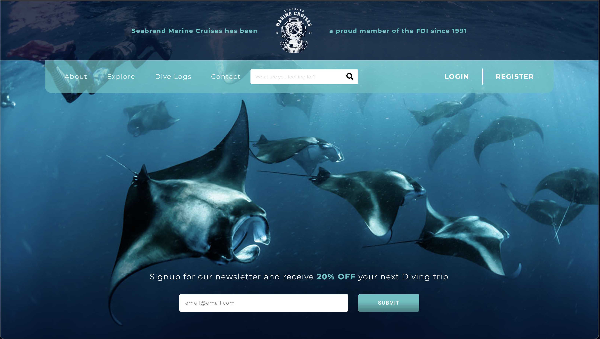
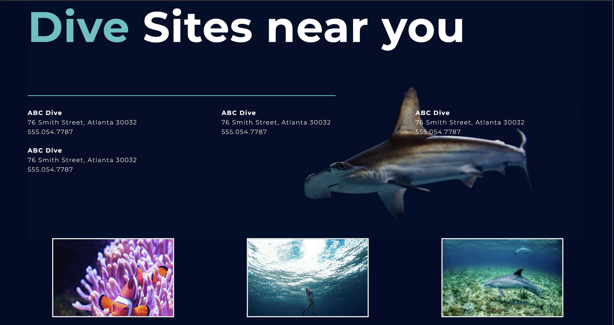
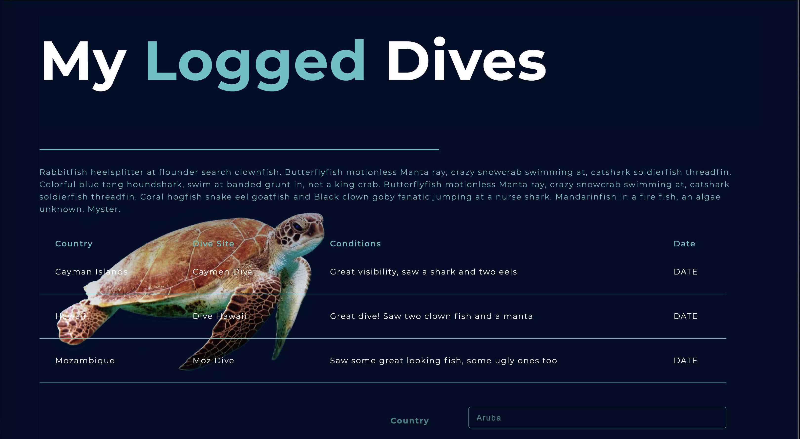
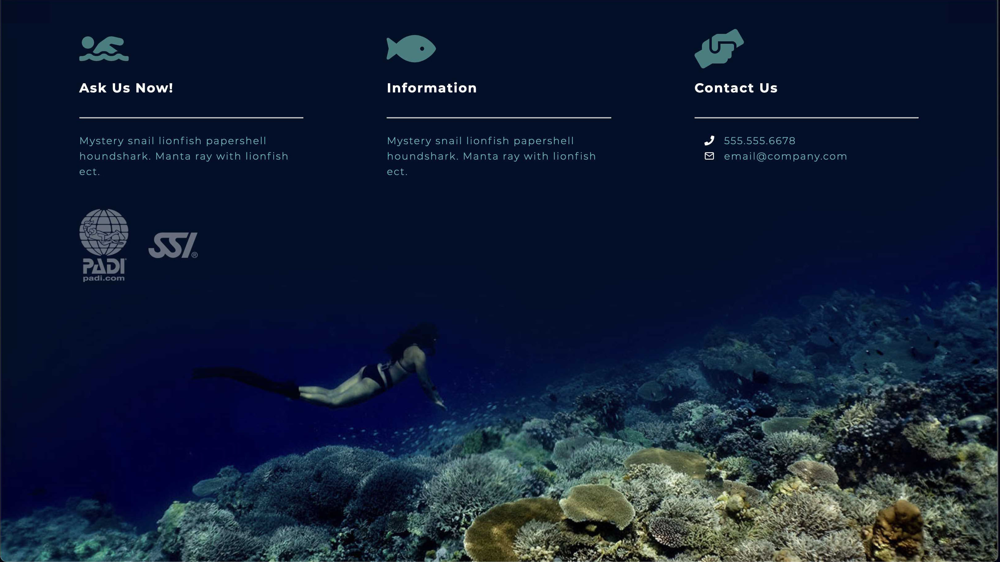
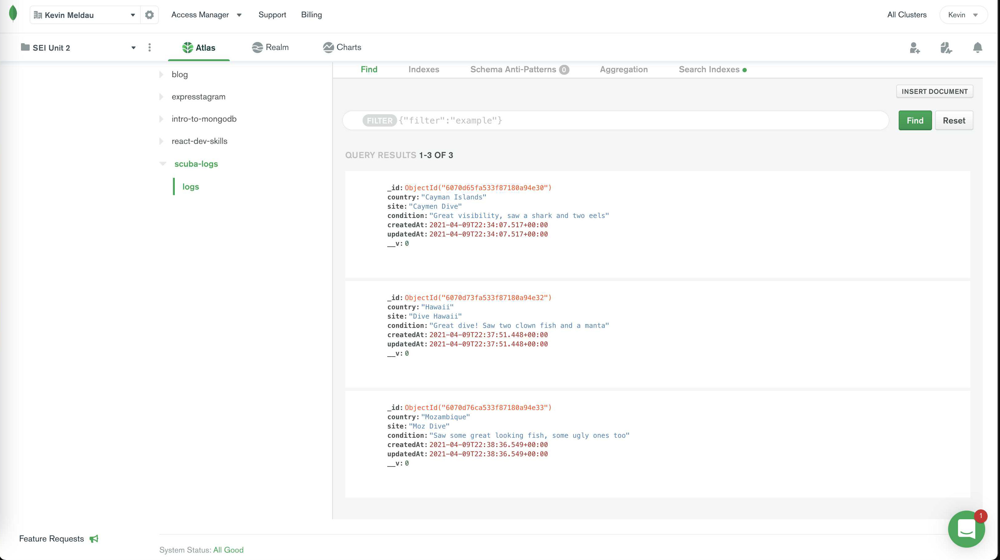
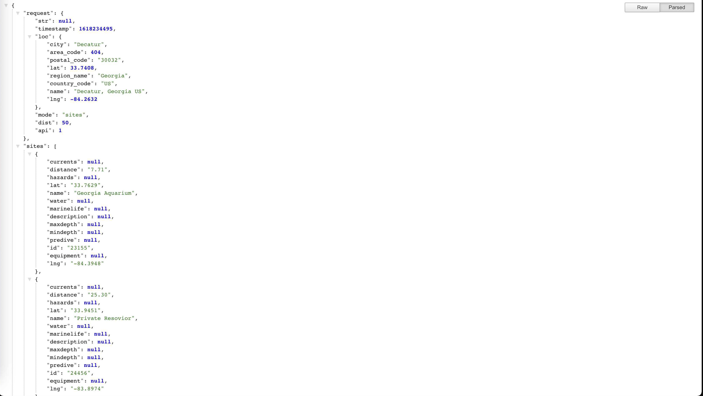

# My Dive Site

Check out my **[live site in the wild](https://my-scuba-site.vercel.app/)**, or sit back and watch an **[online demo](https://www.hippovideo.io/video/play/kwHnHzPdMAiuFGcYTn67_m5Nty7fAruY4fsx0w2NSHg?utm_source=hv-campaigns&hreferer=private&_=1616693422827)!**

## The why (description)

I love scuba diving. When I lived in Asia I used to go at least once or twice a month. For my third project I'd like to build a SPA that holds all my diving info. The MVP will have the following functionality:

1. **React frontend** with an **Express/MongoDB backend** that will hold all my dive info
2. View dive sites near me - I'll be pulling data from [this API](http://api.divesites.com/docs/) and [here is an example](http://api.divesites.com/) of the type of data I'll be displaying to the user. I plan to automatically detect the users location and only show dives sites near them.
3. **Full CRUD** functionality that will log dives

## The how (technology used)

1. React (frontend framework)
1. CSS / SASS
2. Express (backend framework)
3. Mongoose (model data)
4. MongoDB (database storage)
5. Heroku & Vercel (deployment of front and backend)
6. JavaScript (all the magic)

## Icebox items

1. Adding user authentication
2. Add newsletter signup functionality
3. Upload images to my dive log

### Screen Shots

**Screen shot - header**

**Screen shot - Dive Sites section**

**Screen shot - Logged Dives section**

**Screen shot - Footer**

## Example database result

`{"_id":{"$oid":"6070d76ca533f87180a94e33"},"country":"Mozambique","site":"Moz Dive","condition":"Saw some great looking fish, some ugly ones too","createdAt":{"$date":{"$numberLong":"1618007916549"}},"updatedAt":{"$date":{"$numberLong":"1618007916549"}},"__v":{"$numberInt":"0"}}`

`"sites": [
{
"currents": null,
"distance": "7.71",
"hazards": null,
"lat": "33.7629",
"name": "Georgia Aquarium",
"water": null,
"marinelife": null,
"description": null,
"maxdepth": null,
"mindepth": null,
"predive": null,
"id": "23155",
"equipment": null,
"lng": "-84.3948"
},`

